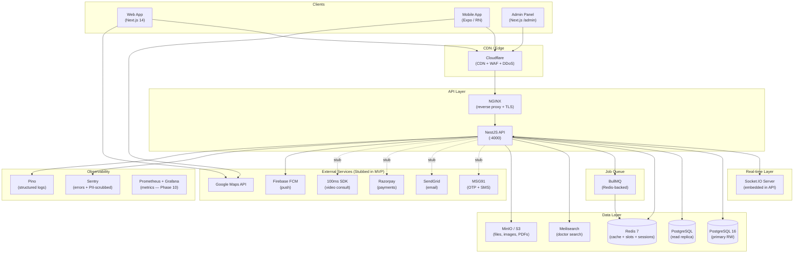
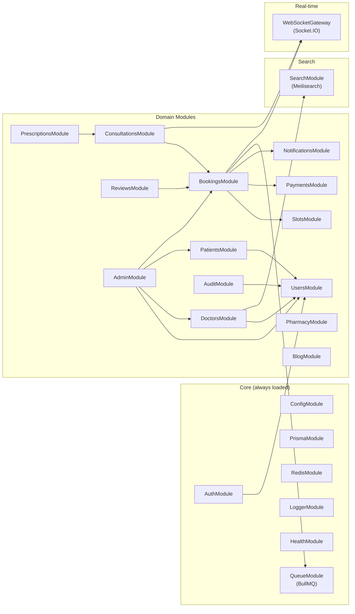
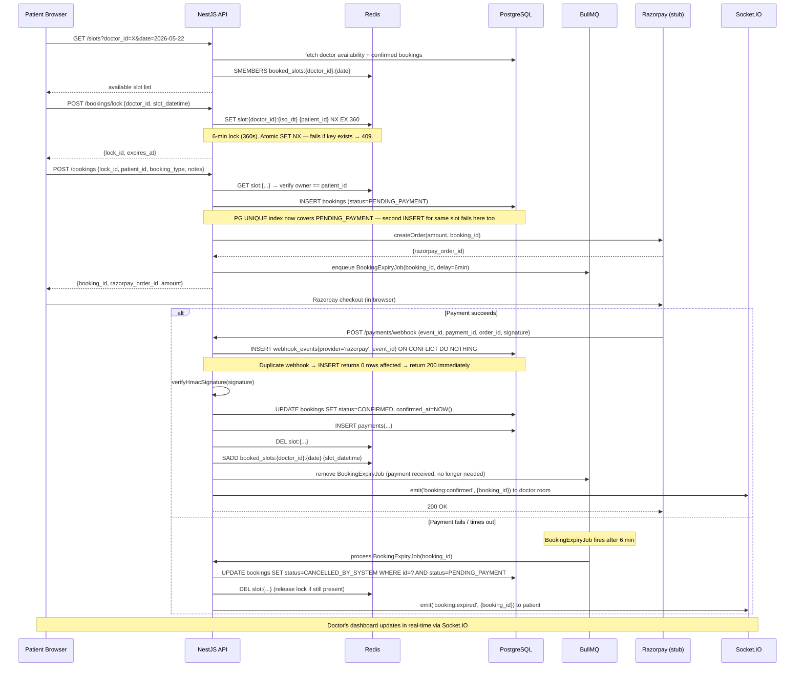
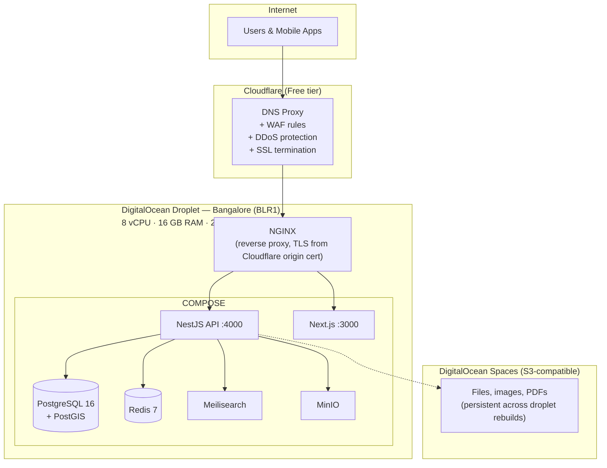
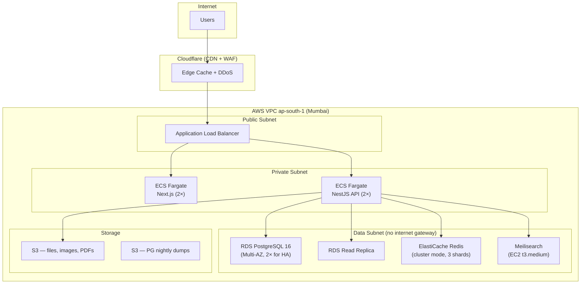

# DocNear — System Architecture

> Version: 1.1 | Status: Approved for Phase 2 scaffold
> Last updated: 2026-05-21

---

## CHANGELOG

### v1.1 (2026-05-21)
| # | Type | Change |
|---|------|--------|
| 1 | MUST FIX | Slot uniqueness: PENDING_PAYMENT now included in PG unique constraint; BullMQ job auto-cancels stale PENDING_PAYMENT bookings; `CANCELLED_BY_SYSTEM` added to state machine; PG is source of truth, Redis is optimisation layer |
| 2 | MUST FIX | Webhook idempotency: `webhook_events` table with `UNIQUE(provider, event_id)`; `INSERT … ON CONFLICT DO NOTHING` pattern documented in booking lifecycle diagram |
| 5 | MUST FIX | CSRF: refresh-token cookie attributes fully specified (`httpOnly`, `Secure`, `SameSite=Strict`, `Path=/auth/refresh`); `/auth/refresh` validates `Origin`/`Referer` against allowlist |
| 6 | SHOULD | MVP Launch Topology added: single DigitalOcean Bangalore droplet; AWS Multi-AZ diagram relabelled as "Phase 10 / scale-state target" |
| 13 | SHOULD | Rate limits replaced generic "5 req/min" with per-route table |
| 14 | SHOULD | i18n architecture section added (next-intl, en/hi/bn, routing strategy) |
| 15 | SHOULD | Column-level encryption section added: lists pgcrypto columns, AES-256 key management, annual rotation policy |
| 19 | SHOULD | Sentry PII scrubbing section added: `beforeSend` hook with full field allowlist |

---

## 1. High-Level Architecture



**Rationale:** Modular monolith first — avoids distributed system complexity while allowing future extraction of hot modules (booking engine, notifications) into microservices without rewriting interfaces.

---

## 2. NestJS Module Boundaries

The API is a **modular monolith** — one process, strict module isolation. Each module owns its own controllers, services, repositories, and DTOs. Cross-module communication goes through injectable services, never direct DB access across module boundaries.



### Module Contracts (Public APIs)

| Module | Exports | Never exposes |
|--------|---------|---------------|
| `UsersModule` | `UsersService` (find, create, update role/status) | Raw Prisma client |
| `DoctorsModule` | `DoctorsService` (profile, availability, search, generateSlug) | Internal slot logic |
| `SlotsModule` | `SlotsService` (generate, lock, release, check) | Redis keys |
| `BookingsModule` | `BookingsService` (create, cancel, lifecycle) | Payment gateway calls |
| `PaymentsModule` | `PaymentsService` (initiate, verify webhook, idempotency check) | Raw Razorpay SDK |
| `NotificationsModule` | `NotificationsService` (send by channel, respect preferences) | Provider SDKs |
| `QueueModule` | `BookingExpiryQueue`, `NotificationQueue`, `PdfQueue` | BullMQ internals |

---

## 3. Booking Lifecycle Data Flow



### Webhook Idempotency

Razorpay may deliver the same webhook event more than once (network retries, delivery guarantees). The pattern:

```sql
-- On every incoming webhook:
INSERT INTO webhook_events (provider, event_id, event_type, payload)
VALUES ('razorpay', $event_id, $event_type, $payload)
ON CONFLICT (provider, event_id) DO NOTHING;

-- Check rows affected:
-- 1 row → first delivery → process normally
-- 0 rows → duplicate → return HTTP 200 immediately, skip processing
```

This is the **only place** Razorpay-specific idempotency is enforced; no other locking is needed because PG uniqueness constraints catch any remaining edge cases.

---

## 4. Real-Time Slot Locking Strategy

### Redis Key Schema

```
slot:lock:{doctor_id}:{YYYYMMDD}T{HHmm}   → patient_id   (STRING, TTL 360s)
booked_slots:{doctor_id}:{YYYYMMDD}        → SET of HHmm  (permanent until cancel — cache of confirmed PG rows)
session:{token_jti}                         → user_id      (STRING, TTL = refresh token TTL 7d)
online_doctors                              → ZSET (doctor_id → last_ping epoch)
```

### Lock + Booking State Machine

**PostgreSQL is the authoritative source of truth. Redis is a performance optimisation layer.**

```
AVAILABLE  (no PG row for this slot)
    │
    │  POST /bookings/lock → Redis SET NX EX 360
    │  ─────── already locked in Redis ──────────────→ 409 SLOT_ALREADY_LOCKED
    ▼
REDIS LOCKED  (Redis key exists, TTL 360s; no PG row yet)
    │
    │  POST /bookings → INSERT bookings(status=PENDING_PAYMENT)
    │  ─────── PG UNIQUE violation (race past Redis) ─→ 409 CONFLICT
    ▼
PENDING_PAYMENT  (PG row exists; Redis key still held)
    │                              │
    │  Razorpay webhook received   │  BullMQ BookingExpiryJob fires (6 min)
    │  → INSERT webhook_events     │  → UPDATE status=CANCELLED_BY_SYSTEM
    │    ON CONFLICT DO NOTHING    │     WHERE status=PENDING_PAYMENT
    │  → if 0 rows: skip (dup)     │  → DEL Redis key (if present)
    │  → UPDATE status=CONFIRMED   │  → slot returns to AVAILABLE
    ▼                              ▼
CONFIRMED                  CANCELLED_BY_SYSTEM
    │
    │  Doctor clicks "Start Consultation"
    ▼
IN_PROGRESS
    │
    │  Doctor clicks "End Consultation"
    ▼
COMPLETED ──────→ [Review unlocked for patient]
    │
    Alternatively:
    │  Patient cancels
    ▼
CANCELLED_BY_PATIENT  → refund per policy → slot AVAILABLE

    │  Doctor cancels
    ▼
CANCELLED_BY_DOCTOR   → full refund → slot AVAILABLE

    │  No-show detected by cron (+30 min)
    ▼
NO_SHOW
```

### Guarantees

1. **Atomicity:** `SET NX EX` is a single atomic Redis command — safe under any concurrency.
2. **PG is authoritative:** The PG unique index `WHERE status NOT IN ('CANCELLED_BY_PATIENT', 'CANCELLED_BY_DOCTOR', 'NO_SHOW', 'CANCELLED_BY_SYSTEM')` now **includes** `PENDING_PAYMENT`, ensuring at most one active booking row per slot regardless of Redis state.
3. **Auto-expiry safety:** If the API crashes between `INSERT bookings` and `enqueue BookingExpiryJob`, a BullMQ repeatable job that runs every 60 seconds will sweep `PENDING_PAYMENT` bookings older than 6 minutes and cancel them. Belt-and-suspenders.
4. **Idempotent cleanup:** Both the BullMQ job and the Redis TTL may both try to clean up the same slot lock; `DEL` on a non-existent key is safe (Redis returns 0, no error).
5. **Clock skew:** All slot datetimes stored and compared in UTC. Display layer converts to IST (+05:30).

### BullMQ Sweep Job (belt-and-suspenders)

```typescript
// Runs every 60 seconds via BullMQ repeatable job
@Processor('booking-expiry-sweep')
async processSweep() {
  const cutoff = new Date(Date.now() - 6 * 60 * 1000); // 6 minutes ago
  await this.prisma.bookings.updateMany({
    where: { status: 'PENDING_PAYMENT', createdAt: { lt: cutoff } },
    data:  { status: 'CANCELLED_BY_SYSTEM', cancelledAt: new Date(),
              cancelledBy: 'SYSTEM', cancellationReason: 'Payment timeout' },
  });
}
```

---

## 5. Caching Strategy

### Redis Layers

| Cache | Key pattern | TTL | Invalidation trigger |
|-------|-------------|-----|----------------------|
| Doctor public profile | `doctor:profile:{doctor_id}` | 5 min | On doctor PATCH |
| Doctor search results | `search:{hash(query)}` | 2 min | On Meilisearch sync |
| Available slots | `slots:available:{doctor_id}:{date}` | 1 min | On booking confirm/cancel/expire |
| Specialities list | `specialities:all` | 1 hour | On admin CRUD |
| Cities list | `cities:all` | 6 hours | On admin CRUD |
| Session (JWT) | `session:{jti}` | 7 days | On logout (`DEL`) |
| OTP | `otp:{phone}` | 10 min | On verify (`DEL`) |
| Rate limit counters | `ratelimit:{key}:{endpoint}` | 60 s | Natural TTL |

### Next.js App Router Caching

| Page | Strategy | Revalidate |
|------|----------|-----------|
| `/blog/[slug]` | ISR | 3600 s |
| `/doctors/[slug]` | ISR | 300 s |
| `/find-doctors` | `no-store` | — (location-aware) |
| `/specialities/*` | ISR | 86400 s |
| All dashboards (`/patient/*`, `/doctor/*`, `/admin/*`) | `no-store` | — |

---

## 6. Security Model

### Authentication Flow

```mermaid
sequenceDiagram
    participant U as User
    participant API as API
    participant Redis as Redis
    participant PG as PG

    U->>API: POST /auth/login {email, password}
    API->>PG: fetch user + compare bcrypt(12) hash
    API->>API: generate accessToken (JWT RS256, 15min, jti=uuid)
    API->>API: generate refreshToken (JWT RS256, 7d, jti=uuid)
    API->>Redis: SET session:{access_jti} user_id EX 900
    API->>Redis: SET session:{refresh_jti} user_id EX 604800
    API-->>U: {access_token} in JSON body
    Note over API,U: refreshToken set as httpOnly cookie:\nSet-Cookie: refresh_token=...\n  HttpOnly; Secure; SameSite=Strict;\n  Path=/v1/auth/refresh; Max-Age=604800

    U->>API: GET /me (Authorization: Bearer accessToken)
    API->>API: verify JWT signature + expiry (RS256 public key)
    API->>Redis: GET session:{jti} → confirm not logged-out
    API-->>U: user data

    U->>API: POST /v1/auth/refresh (cookie sent automatically)
    API->>API: validate Origin or Referer header against allowlist
    Note over API: Allowlist: https://docnear.in,\nhttps://staging.docnear.in\nReject all others → 403
    API->>Redis: GET session:{refresh_jti} → valid + not revoked
    API->>API: revoke old refresh JTI (DEL session:{refresh_jti})
    API->>API: issue new access + refresh pair
    API-->>U: new access_token + new httpOnly refresh cookie
```

### Refresh Token Cookie Specification

```
Set-Cookie: refresh_token=<jwt>
  HttpOnly          -- not accessible via document.cookie (XSS protection)
  Secure            -- HTTPS only
  SameSite=Strict   -- not sent on cross-site requests (CSRF protection)
  Path=/v1/auth/refresh  -- scoped: cookie only sent to the refresh endpoint
  Max-Age=604800    -- 7 days
```

**CSRF defence:** `SameSite=Strict` prevents the cookie from being sent by cross-origin requests. The `/v1/auth/refresh` endpoint additionally validates the `Origin` (or fallback `Referer`) header against a hardcoded allowlist: `['https://docnear.in', 'https://staging.docnear.in', 'http://localhost:3000']`. Requests from any other origin receive `403 Forbidden` before token rotation occurs.

### RBAC Enforcement

```typescript
// Every protected route decorated at controller level
@UseGuards(JwtAuthGuard, RolesGuard)
@Roles(Role.DOCTOR, Role.SUPER_ADMIN)
@Get('/:id/earnings')
```

- `JwtAuthGuard` — verifies RS256 signature, checks Redis session, attaches `req.user`
- `RolesGuard` — reads `@Roles()` metadata, compares against `req.user.role`
- Resource ownership check **in service layer**: `if (booking.patientId !== req.user.id) throw new ForbiddenException()`

### Rate Limits (per route)

Implemented via `@nestjs/throttler` with Redis store for distributed counting.

| Route | Limit | Window | Key |
|-------|-------|--------|-----|
| `POST /auth/login` | 5 req | 60 s | per IP |
| `POST /auth/register/*` | 3 req | 300 s | per IP |
| `POST /auth/otp/send` | 3 req | 60 s | per phone number |
| `POST /auth/otp/verify` | 10 req | 60 s | per phone number |
| `POST /bookings/lock` | 10 req | 60 s | per authenticated user |
| `POST /bookings` | 5 req | 60 s | per authenticated user |
| `POST /payments/webhook` | **no limit** | — | Razorpay IPs allowlisted at NGINX level |
| `GET /doctors` (search) | 60 req | 60 s | per IP |
| All other authenticated | 60 req | 60 s | per authenticated user |
| All other unauthenticated | 30 req | 60 s | per IP |

Rate limit response headers on every response:
```
X-RateLimit-Limit: 5
X-RateLimit-Remaining: 2
X-RateLimit-Reset: 1716300060
```
Exceeding limit: `HTTP 429` with `Retry-After` header.

**Razorpay webhook IP allowlist (NGINX):**
```nginx
# /etc/nginx/conf.d/docnear.conf
location /v1/payments/webhook {
    allow 103.21.244.0/22;   # Razorpay IP ranges (keep updated)
    allow 103.31.4.0/22;
    deny all;
    proxy_pass http://api:4000;
}
```

### OWASP Top 10 Mitigations

| Risk | Mitigation |
|------|-----------|
| A01 Broken Access Control | RBAC guard on every route; ownership assertions in services; doctor sees only own patients |
| A02 Cryptographic Failures | bcrypt(12) for passwords; JWT RS256; column-level pgcrypto AES-256 for PII; TLS 1.3 everywhere |
| A03 Injection | Prisma ORM (parameterised queries only); Zod validation on all request bodies |
| A04 Insecure Design | Redis+PG double slot uniqueness; webhook idempotency table; payment HMAC verification |
| A05 Security Misconfiguration | Helmet.js headers; CORS origin allowlist; non-root Docker user; secrets via env only |
| A06 Vulnerable Components | `pnpm audit` in CI; Dependabot PRs on all workspaces |
| A07 Auth Failures | Per-route rate limits (table above); OTP 10-min TTL; 5-attempt lockout; token rotation on refresh |
| A08 Software Integrity | HMAC signature verification on Razorpay webhooks; signed S3 pre-signed URLs only |
| A09 Logging Failures | Pino structured logs with correlation IDs; PHI access logged to `audit_logs`; Sentry (PII-scrubbed) |
| A10 SSRF | No user-provided URLs fetched server-side; Maps API calls made client-side only |

### PHI Access Audit Log

Every read of patient-identifiable data by a doctor emits an audit entry:
```json
{
  "actor_id": "dr_123",
  "action": "VIEW_PATIENT_RECORD",
  "resource_type": "patient",
  "resource_id": "pt_456",
  "ip_address": "203.x.x.x",
  "user_agent": "Mozilla/...",
  "ts": "2026-05-21T08:00:00Z"
}
```
`audit_logs` is append-only. No service may `UPDATE` or `DELETE` from it.

---

## 7. Column-Level Encryption (pgcrypto)

### Encrypted Columns

| Table | Column | Type | Reason |
|-------|--------|------|--------|
| `users` | `phone` | `BYTEA` | PII — mobile number is uniquely identifying |
| `patient_profiles` | `dob` | `BYTEA` | PHI — date of birth |
| `patient_profiles` | `allergies` | `BYTEA` | PHI — medical information |
| `patient_profiles` | `chronic_conditions` | `BYTEA` | PHI — medical information |
| `prescriptions` | `medicines` | `BYTEA` | PHI — medication details |
| `prescriptions` | `diagnosis` | `BYTEA` | PHI — clinical diagnosis |
| `prescriptions` | `advice` | `BYTEA` | PHI — clinical advice |
| `doctor_bank_accounts` | `account_number_enc` | `BYTEA` | PCI — bank account number |

Columns marked `BYTEA` store `pgcrypto.pgp_sym_encrypt(plaintext, key)`. A cleartext surrogate is stored alongside for indexable lookups (e.g., `phone_hash TEXT` stores `SHA-256(phone)` for unique-lookup without exposing plaintext).

**Prisma note:** Encrypted columns are raw `Bytes` in Prisma. Encryption/decryption is the responsibility of the `CryptoService` in the API — never done in the DB layer directly.

```typescript
// core/crypto/crypto.service.ts
@Injectable()
export class CryptoService {
  private readonly key: string;
  constructor(config: ConfigService) {
    this.key = config.get<string>('ENCRYPTION_KEY'); // 32-byte hex from env
  }

  encrypt(plaintext: string): Buffer {
    // pgp_sym_encrypt-compatible AES-256-CBC via node:crypto
    const iv = randomBytes(16);
    const cipher = createCipheriv('aes-256-cbc', Buffer.from(this.key, 'hex'), iv);
    return Buffer.concat([iv, cipher.update(plaintext, 'utf8'), cipher.final()]);
  }

  decrypt(ciphertext: Buffer): string {
    const iv = ciphertext.subarray(0, 16);
    const data = ciphertext.subarray(16);
    const decipher = createDecipheriv('aes-256-cbc', Buffer.from(this.key, 'hex'), iv);
    return decipher.update(data).toString('utf8') + decipher.final('utf8');
  }
}
```

### Encryption Key Management

| Env | Key storage | Access |
|-----|------------|--------|
| dev | `.env` file (gitignored) | Developer machines |
| staging | DigitalOcean App Platform secret | CI + runtime only |
| prod | AWS Secrets Manager (or DO Managed Secrets) | Runtime role only; no human access |

**Rotation policy:**
1. Generate new `ENCRYPTION_KEY_V2` and deploy alongside `ENCRYPTION_KEY_V1`.
2. New writes use V2. Reads attempt V2 first, fall back to V1.
3. Run background migration job: re-encrypt all V1 rows with V2. Log progress to `system_settings`.
4. After all rows migrated, remove V1 from secrets store and code.
5. Rotation cadence: annually or on any suspected key compromise.

---

## 8. i18n Architecture

DocNear supports three locales from day 1: **English (`en`)**, **Hindi (`hi`)**, **Bengali (`bn`)**.

### Library: `next-intl`

```
apps/web/
├── messages/
│   ├── en.json       ← source-of-truth strings
│   ├── hi.json
│   └── bn.json
├── i18n/
│   ├── config.ts     ← { locales: ['en','hi','bn'], defaultLocale: 'en' }
│   └── routing.ts    ← createLocalizedPathnamesNavigation(...)
└── middleware.ts      ← next-intl locale detection + routing
```

### URL Strategy

Locale is an optional URL prefix. The default locale (`en`) has no prefix to avoid breaking existing links and SEO.

```
/find-doctors            → English (default)
/hi/find-doctors         → Hindi
/bn/find-doctors         → Bengali
/doctors/dr-arun-sharma  → English
/hi/doctors/dr-arun-sharma → Hindi
```

Locale is detected in this order:
1. URL prefix (`/hi/…`)
2. `Accept-Language` header
3. Fallback: `en`

### Usage in Code

```typescript
// Server component (App Router)
import { getTranslations } from 'next-intl/server';
const t = await getTranslations('DoctorCard');
return <h2>{t('consultFee', { amount: formatCurrency(fee) })}</h2>;

// Client component
import { useTranslations } from 'next-intl';
const t = useTranslations('BookingFlow');
```

### Message File Structure (excerpt)

```json
// en.json
{
  "DoctorCard": {
    "consultFee": "Consult fee: {amount}",
    "bookNow": "Book Now",
    "available": "Available today"
  },
  "BookingFlow": {
    "selectSlot": "Select a time slot",
    "lockExpiry": "Slot held for {seconds}s"
  }
}
```

### RTL Consideration

Hindi and Bengali are LTR scripts — no RTL CSS changes needed for v1. Future: Urdu (`ur`) would require RTL layout toggle.

---

## 9. Observability & Sentry PII Scrubbing

### Structured Logging (Pino)

All log entries include:
```json
{
  "level": "info",
  "time": "2026-05-21T08:00:00.000Z",
  "correlationId": "req-abc123",   ← set by correlation-id middleware on every request
  "userId": "usr_xxx",
  "module": "BookingsService",
  "msg": "Booking confirmed",
  "bookingId": "bkg_yyy"
}
```

**Never log:** passwords, OTPs, access tokens, refresh tokens, phone numbers, prescription content, bank account details, MCI reg numbers.

### Sentry Integration

```typescript
// apps/api/src/main.ts
Sentry.init({
  dsn: process.env.SENTRY_DSN,
  environment: process.env.NODE_ENV,
  tracesSampleRate: 0.1,   // 10% of transactions — adjust in prod

  beforeSend(event: Sentry.Event): Sentry.Event | null {
    // Scrub PII from request bodies and extra context
    const REDACTED = '[REDACTED]';
    const PII_FIELDS = [
      'email', 'phone', 'password', 'passwordHash', 'otp',
      'dob', 'dateOfBirth', 'allergies', 'chronicConditions',
      'medicines', 'diagnosis', 'advice',            // prescription PHI
      'address', 'addressLine1', 'deliveryAddress',  // location PII
      'accountNumber', 'accountNumberEnc', 'ifscCode', 'holderName',
      'mciRegNo', 'registrationDocUrl', 'idProofUrl',
      'accessToken', 'refreshToken', 'token',
    ];

    if (event.request?.data) {
      PII_FIELDS.forEach(field => {
        if (event.request!.data[field]) {
          event.request!.data[field] = REDACTED;
        }
      });
    }

    // Scrub from exception extras
    if (event.extra) {
      PII_FIELDS.forEach(field => {
        if (event.extra![field]) event.extra![field] = REDACTED;
      });
    }

    return event;
  },

  // Do not send events for known non-actionable errors
  ignoreErrors: ['UnauthorizedException', 'ForbiddenException', 'NotFoundException'],
});
```

```typescript
// apps/web/src/app/sentry.client.config.ts
Sentry.init({
  dsn: process.env.NEXT_PUBLIC_SENTRY_DSN,
  beforeSend(event) {
    // Strip any accidentally captured form values
    if (event.request?.data) {
      delete event.request.data;  // never send form bodies from browser
    }
    return event;
  },
});
```

### Bull Dashboard

The BullMQ job queue dashboard is mounted at `/admin/queues` (API route, SUPER_ADMIN only, password-protected via `bull-board`). Displays job counts, failed jobs, retry controls.

---

## 10. Deployment Topology

### Development (Local)

```
localhost
├── :3000  Next.js (web + admin)
├── :4000  NestJS API
├── :5432  PostgreSQL 16 + PostGIS (Docker)
├── :6379  Redis 7 (Docker)
├── :7700  Meilisearch (Docker)
└── :9000  MinIO (Docker)
```

---

### MVP Launch Topology — DigitalOcean (Phases 1–9)

> **This is the actual launch infrastructure.** Single-server, lowest cost, zero managed service overhead. Sufficient for < 5,000 daily active users.



**Backup on MVP:** Nightly `pg_dump` uploaded to DigitalOcean Spaces. Redis is ephemeral (only caches — no data loss risk). MinIO data mirrored to Spaces weekly.

**Scaling trigger:** When p95 API latency exceeds 500ms under normal load, or monthly active users exceed 10,000 → migrate to Phase 10 topology.

---

### Scale-State Target — AWS (Phase 10+)

> **Not the MVP infrastructure.** Provision this when DocNear reaches scale.



### Environment Tiers

| Env | Infrastructure | Branch | Deploy trigger | Approval needed |
|-----|---------------|--------|---------------|----------------|
| dev | localhost Docker Compose | any | `docker-compose up` | none |
| staging | DO Droplet (smaller: 4GB) | `main` | auto on merge | none |
| prod | DO Droplet (MVP) → AWS (scale) | `release/*` | manual `workflow_dispatch` | 1 reviewer |

---

## 11. Key Architectural Decisions

| Decision | Choice | Rationale |
|----------|--------|-----------|
| Backend architecture | Modular monolith (NestJS) | Avoids distributed system overhead at MVP scale; module boundaries allow future extraction |
| ORM | Prisma | Type-safe, excellent migration tooling; avoids raw SQL injection risk |
| Real-time transport | Socket.IO (embedded) | Simpler than standalone WS server; automatic long-poll fallback for bad mobile connections |
| Search | Meilisearch | Typo-tolerant, instant search, lightweight; Elasticsearch is overkill for MVP |
| Slot locking | Redis SET NX + PG UNIQUE | Redis is atomic O(1) first line; PG unique index covers PENDING_PAYMENT as second line |
| Webhook idempotency | `webhook_events` UNIQUE(provider, event_id) | Prevents double-processing of Razorpay duplicate events; one atomic INSERT decides |
| Auth token strategy | Short JWT + httpOnly SameSite=Strict refresh cookie | XSS protection for refresh token; CSRF covered by SameSite + Origin header check |
| Video | 100ms SDK stub | Avoids WebRTC complexity in Phase 1; production-ready SDK integrates cleanly later |
| Monorepo | pnpm workspaces + Turborepo | Fast installs, shared packages, build caching across apps |
| MVP infra | Single DO Bangalore droplet | Minimises ops burden; Cloudflare provides CDN + DDoS; scales to AWS when warranted |
| Column encryption | Node.js CryptoService (AES-256-CBC) wrapping pgcrypto-compatible format | PII protected at rest; key rotation possible without DB migration |
| i18n | next-intl | First-class App Router support; compile-time type safety on message keys |
