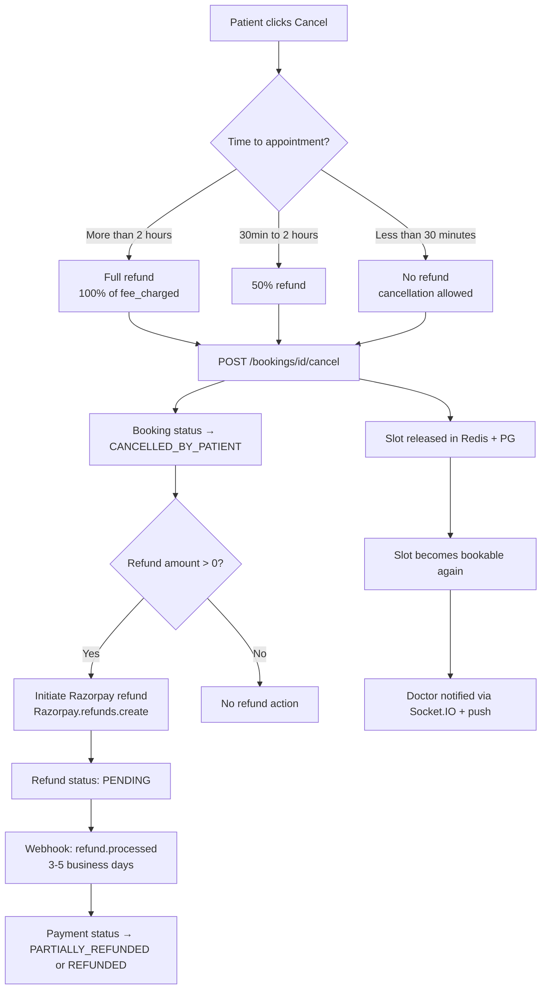
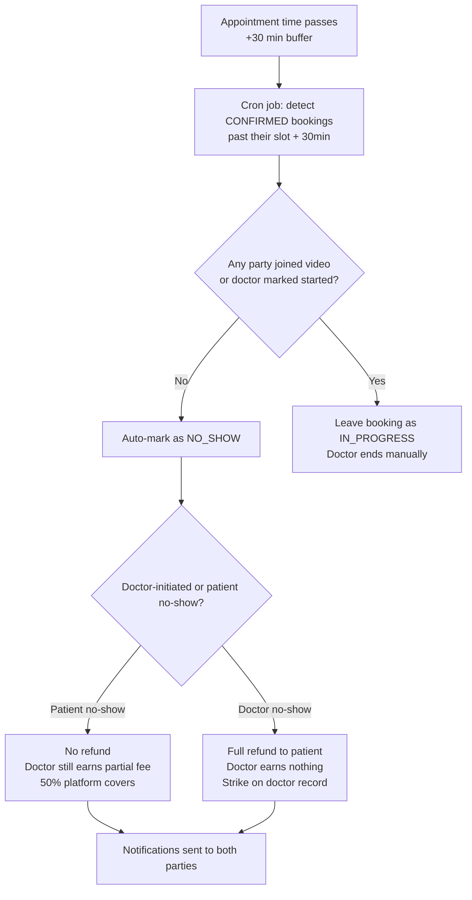
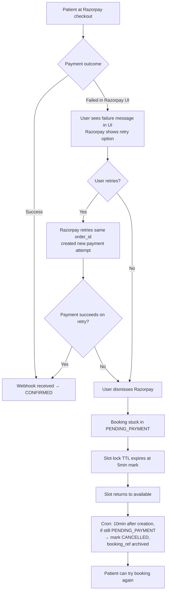
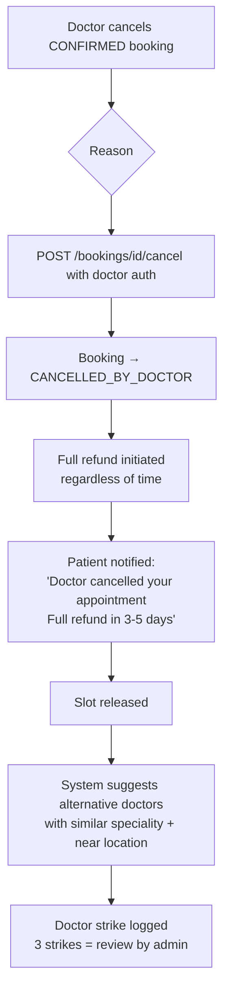
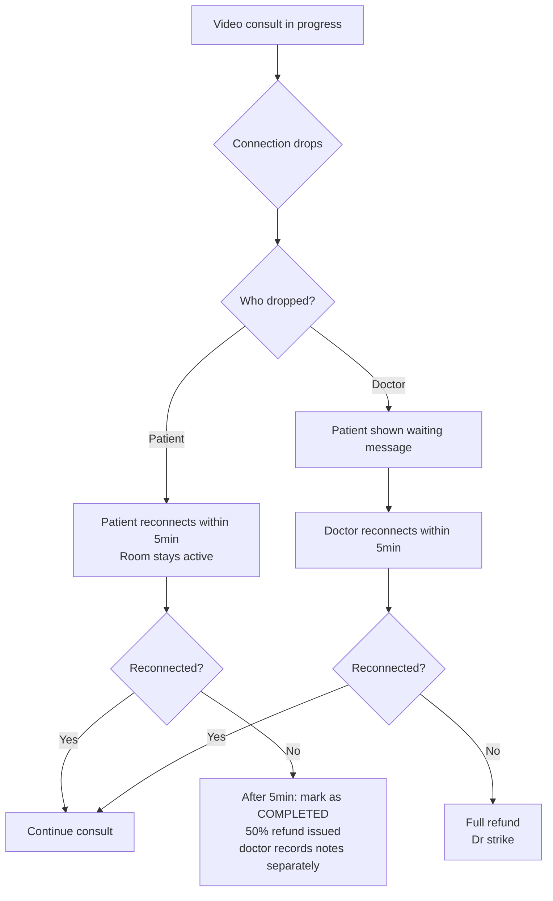
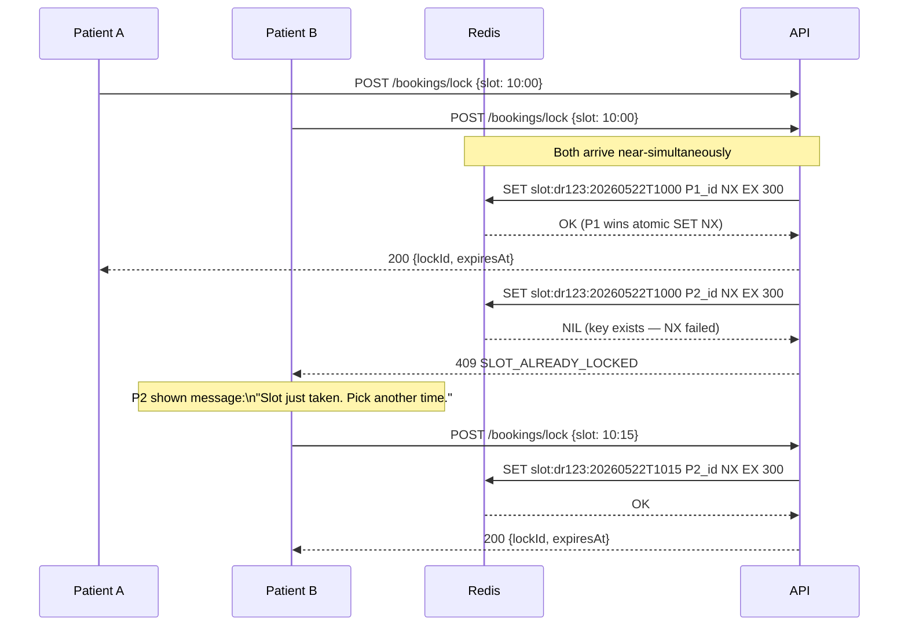

# DocNear — User Flows & Edge Cases

> Version: 1.0
> Last updated: 2026-05-21

---

## 1. Patient Happy Path — Signup → Search → Book → Consult → Review

```mermaid
flowchart TD
    A([Patient visits docnear.in]) --> B{Has account?}
    B -- No --> C[/signup/patient]
    C --> C1[Enter name + phone]
    C1 --> C2[Receive OTP via SMS]
    C2 --> C3[Verify OTP]
    C3 --> C4[Status: APPROVED\nauto-approve on OTP verify]
    B -- Yes --> D[/login]
    D --> D1[Login with phone+OTP\nor email+password\nor Google]

    C4 & D1 --> E[Home Page]
    E --> F{Location permission}
    F -- Granted --> G[Auto-detect city + coords]
    F -- Denied --> H[Enter city manually]
    G & H --> I[/find-doctors page]

    I --> J[Search by name/speciality/symptom]
    J --> K[Filter: distance / fee / gender / language / available today]
    K --> L[List + Map toggle view]
    L --> M[Click doctor card]
    M --> N[/doctors/dr-name-slug]
    N --> O[View profile: qualifications, fee, reviews, clinics]
    O --> P[Select: In-Clinic or Video]
    P --> Q[Pick date from calendar]
    Q --> R[Pick time slot]
    R --> S[POST /bookings/lock\n→ 5-min hold]
    S --> T{For self or family?}
    T -- Family --> T1[Select family member\nor add new one]
    T -- Self --> U
    T1 --> U[Enter patient notes optional]
    U --> V[Apply coupon optional]
    V --> W[Review booking summary]
    W --> X[POST /bookings\n→ get Razorpay order]
    X --> Y[Razorpay checkout opens]
    Y --> Z{Payment outcome}
    Z -- Success --> Z1[Webhook: booking CONFIRMED]
    Z -- Failure --> Z2[Booking auto-cancelled\nslot released]
    Z1 --> AA[/bookings/id — confirmation page]
    AA --> BB[Receive: SMS + email + push notification]

    BB --> CC{Consult type?}
    CC -- In-Clinic --> CD[Show clinic address + map]
    CC -- Video --> CE[Show Join Room button\nenabled 15min before slot]

    CD & CE --> CF{Day of appointment}
    CF --> CG[Reminder: 24h before → SMS + push]
    CG --> CH[Reminder: 1h before]
    CH --> CI[Reminder: 15min before]

    CI --> CJ{Consult type again}
    CJ -- Video --> CK[Patient clicks Join Room]
    CK --> CL[100ms video room opens]
    CL --> CM[Doctor admits patient]
    CM --> CN[Consultation in progress]
    CJ -- In-Clinic --> CO[Patient visits clinic]

    CN & CO --> CP[Doctor ends consult\nStatus → COMPLETED]
    CP --> CQ[Doctor fills prescription]
    CQ --> CR[Prescription finalized + PDF generated]
    CR --> CS[Patient receives notification: Prescription Ready]
    CS --> CT[Patient downloads PDF from /bookings/id]

    CT --> CU[24h after consult:\nReview prompt notification]
    CU --> CV[Patient submits rating + comment + tags]
    CV --> CW[Review published\nDoctor avg_rating updated]
```

---

## 2. Doctor Happy Path — Register → Approved → Set Availability → Consult → Payout

```mermaid
flowchart TD
    A([Doctor visits docnear.in/signup/doctor]) --> B[Fill form:\nname, email, password,\nphone, MCI reg no,\nqualifications, specialities]
    B --> C[Upload: registration certificate + ID proof]
    C --> D[POST /auth/register/doctor]
    D --> E[Status: PENDING\nAuto-email: "Application received"]

    E --> F[SUPER ADMIN reviews\nPending Queue]
    F --> G{Admin decision}
    G -- Approve --> H[Status → APPROVED\nEmail + SMS: "Congratulations!"]
    G -- Reject --> I[Status → REJECTED\nEmail with rejection reason]
    I --> I1[Doctor can re-apply after 30 days]

    H --> J[Doctor logs in]
    J --> K[Profile Completion Wizard]
    K --> K1[Step 1: Professional Details\nbio, experience, consultation fee,\nlanguages, slot duration]
    K1 --> K2[Step 2: Add Clinic Locations\nname, address, lat/lng via Maps\ncity, working hours]
    K2 --> K3[Step 3: Set Weekly Availability\nfor each day: morning/evening blocks\nIN_CLINIC or VIDEO]
    K3 --> L[Profile published on platform]

    L --> M[Doctor Dashboard\n/doctor/dashboard]
    M --> N[Today's appointments list]
    N --> O{Upcoming booking arrives}
    O --> P[Real-time notification via Socket.IO]
    P --> Q[Doctor sees booking in queue]

    Q --> R{Consult type?}
    R -- In-Clinic --> S[Patient arrives at clinic]
    R -- Video --> T[15min before: Join Room button active]
    T --> U[Doctor clicks Join Room\n100ms video room opens]
    U --> V[Click Admit Patient]

    S & V --> W[Consult in progress]
    W --> X[Doctor opens prescription panel]
    X --> Y[Fill: diagnosis, medicines,\ndosage, instructions, advice]
    Y --> Z[POST /prescriptions/{bookingId}/finalize]
    Z --> ZA[PDF generated + uploaded to S3]
    ZA --> ZB[Click End Consultation]
    ZB --> ZC[Booking status → COMPLETED]
    ZC --> ZD[Patient notified]

    ZD --> ZE[Earnings ledger updated\nplatform commission deducted]
    ZE --> ZF[Doctor requests payout\n/doctor/earnings page]
    ZF --> ZG[Admin processes payout\nbank transfer + UTR number]
    ZG --> ZH[Doctor notified: Payout processed]
```

---

## 3. Super Admin Happy Path — Login → Verify → Manage → Analytics

```mermaid
flowchart TD
    A([Admin visits docnear.in/admin]) --> B[Login with seeded SUPER_ADMIN credentials]
    B --> C[Admin Dashboard\n/admin]
    C --> D[KPI Cards: bookings today, revenue,\npending approvals, active consults]

    D --> E{Pending doctor approvals?}
    E -- Yes --> F[Click Pending Queue\n/admin/doctors?status=PENDING]
    F --> G[Review: MCI no, qualifications, docs]
    G --> H{Decision}
    H -- Approve --> I[POST /admin/doctors/id/approve\nDoctor email sent]
    H -- Reject --> J[POST /admin/doctors/id/reject\nEnter rejection reason]

    D --> K[Manage Specialities\n/admin/specialities]
    K --> L[CRUD: add/edit/reorder specialities]

    D --> M[Manage Cities\n/admin/cities]
    M --> N[Enable/disable cities]

    D --> O[Manage Content\n/admin/blog]
    O --> P[Create/edit/publish articles]
    P --> Q[SEO preview + publish]

    D --> R[Pharmacy Management]
    R --> R1[/admin/pharmacy/products — CRUD]
    R --> R2[/admin/pharmacy/orders — verify Rx, update status]

    D --> S[Payouts\n/admin/payouts]
    S --> T[Review pending payout requests]
    T --> U[Process bank transfer externally]
    U --> V[POST /admin/payouts/id/process\nEnter UTR, mark paid]

    D --> W[Analytics\n/admin/analytics]
    W --> W1[Bookings over time chart]
    W --> W2[Revenue by city]
    W --> W3[Top doctors by bookings]
    W --> W4[Top specialities]

    D --> X[Audit Logs\n/admin/audit-logs]
    X --> Y[Search by actor, resource, date]
    Y --> Z[Export CSV]

    D --> AA[Coupons\n/admin/coupons]
    AA --> AB[Create flat or % discount coupon\nwith usage limits + expiry]

    D --> AC[Banners\n/admin/banners]
    AC --> AD[Upload homepage banners\nlink + CTA text + active toggle]
```

---

## 4. Edge Cases & Exception Flows

### 4.1 Cancellation & Refund Policy



### 4.2 No-Show Flow



### 4.3 Payment Failure Flow



### 4.4 Doctor Unavailable (Cancels Confirmed Booking)



### 4.5 Video Consult — Connectivity Issues



### 4.6 Concurrent Slot Booking Race Condition



### 4.7 Doctor Registration Rejection → Re-application

```
1. Doctor registers → status: PENDING
2. Admin reviews → REJECTED (with reason)
3. Doctor receives email with rejection reason
4. Doctor can update their profile + re-upload documents after 30 days
5. Admin re-reviews
6. If rejected twice: flagged for manual review, cannot self-apply
   (contacts support)
```

### 4.8 Account Deletion (GDPR Right to Erasure)

```
Patient requests account deletion via /settings/delete-account
→ Soft delete: deleted_at timestamp set, login blocked immediately
→ 30-day grace period (can reactivate by contacting support)
→ After 30 days: hard purge cron runs
  - PII fields overwritten with REDACTED markers
  - Prescription records retained (medical legal requirement, 7 years)
    but patient_id nullified, replaced with deleted_patient reference
  - Bookings anonymized (not deleted — needed for doctor earnings records)
  - Reviews deleted
  - Notifications deleted
  - Family member profiles deleted
  - S3 files: avatar + uploaded docs deleted
→ Confirmation email sent after purge
```

### 4.9 Doctor Payout Request

```
1. Doctor views earnings dashboard (/doctor/earnings)
2. Sees: total_earned, platform_commission_deducted, available_for_payout
3. Requests payout (min ₹500 threshold)
4. Payout request created → status: REQUESTED
5. Admin sees in /admin/payouts queue
6. Admin processes bank transfer externally (NEFT/IMPS)
7. Admin enters UTR number → marks COMPLETED
8. Doctor notified: "₹X has been transferred to your account ending XXXX"
```

---

## 5. Notification Matrix

| Event | Patient | Doctor | Admin | Channels |
|-------|---------|--------|-------|---------|
| Booking confirmed | ✅ | ✅ | — | Push + SMS + Email |
| 24h reminder | ✅ | ✅ | — | Push + SMS |
| 1h reminder | ✅ | ✅ | — | Push |
| 15min reminder | ✅ | ✅ | — | Push |
| Consult started | ✅ | — | — | Push |
| Consult ended | ✅ | — | — | In-App |
| Prescription ready | ✅ | — | — | Push + SMS |
| Booking cancelled (by patient) | — | ✅ | — | Push + SMS |
| Booking cancelled (by doctor) | ✅ | — | — | Push + SMS + Email |
| No-show (patient) | ✅ | — | — | In-App |
| Payment failed | ✅ | — | — | Push + Email |
| Refund initiated | ✅ | — | — | Push + Email |
| Doctor approved | — | ✅ | — | Email + SMS |
| Doctor rejected | — | ✅ | — | Email |
| Payout processed | — | ✅ | — | Push + SMS + Email |
| New doctor pending | — | — | ✅ | Email |
| Rx fraud flag (future) | — | — | ✅ | Email |

---

## 6. Patient Booking Cancellation Rules (Summary)

| Time before appointment | Refund | Slot Release |
|------------------------|--------|-------------|
| > 2 hours | 100% | Immediate |
| 30 min – 2 hours | 50% | Immediate |
| < 30 min | 0% | Immediate |
| Doctor cancels | 100% | Immediate |
| No-show (patient) | 0% | N/A |
| No-show (doctor) | 100% | N/A |
| Payment not completed (TTL) | N/A (not charged) | After 5 min TTL |
