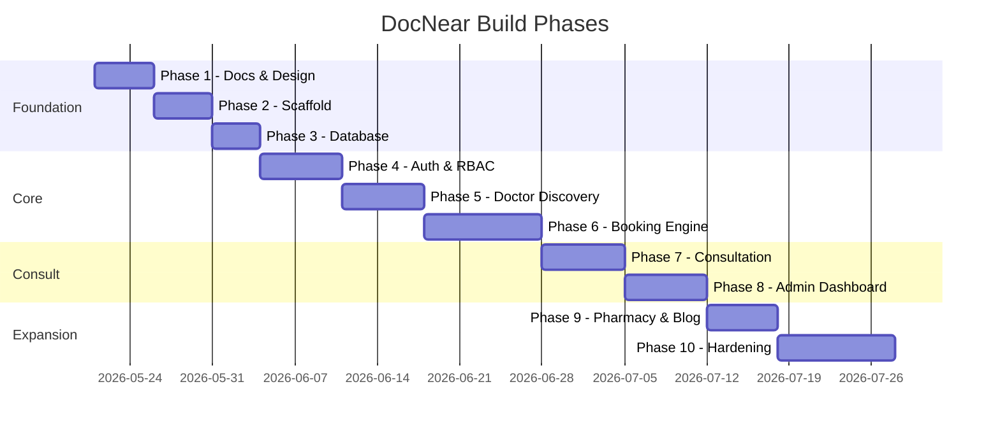
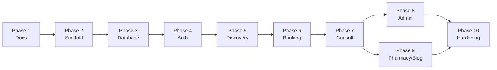

# DocNear — 10-Phase Project Plan

> Version: 1.0
> Last updated: 2026-05-21
> Total estimated effort: 14-18 weeks (solo full-stack) / 8-10 weeks (2-person team)

---

## Overview

---

## Phase 1 — Architecture & Design Docs ✅

**Duration:** 3-5 days
**Goal:** Complete design before writing a single line of code. All technical decisions documented, reviewed, and locked.

### Deliverables

| Doc | Contents |
|-----|----------|
| `docs/01-ARCHITECTURE.md` | System arch, module boundaries, slot-locking, caching, security, deployment |
| `docs/02-DATABASE.md` | Full ERD, table definitions, indexes, RLS, migrations, seed plan |
| `docs/03-API-CONTRACTS.md` | OpenAPI 3.1, all endpoints, error standard, WebSocket events, rate limits |
| `docs/04-USER-FLOWS.md` | Patient/Doctor/Admin happy paths, edge cases, cancellation/refund flows |
| `docs/05-FOLDER-STRUCTURE.md` | Full monorepo tree with file-level annotations |
| `docs/06-PHASE-PLAN.md` | This document |

### Exit Criteria
- [ ] All 6 docs written and committed to `main`
- [ ] Architecture diagram reviewed and approved
- [ ] Database schema reviewed — no obvious missing tables or relationships
- [ ] API contract reviewed — no missing endpoints for MVP flows
- [ ] Tech stack frozen and documented
- [ ] **STOP: Human review before Phase 2**

### Demo
Show docs side-by-side. Walk through the booking lifecycle sequence diagram.

---

## Phase 2 — Monorepo Scaffold & Bootstrap

**Duration:** 4-5 days
**Goal:** All 3 apps boot cleanly. No business logic yet — infrastructure only.

### Deliverables

**Root**
- [ ] `pnpm-workspace.yaml`, `turbo.json`, `package.json`
- [ ] `tsconfig.base.json`, `.editorconfig`, `.gitignore`, `.nvmrc` (Node 20)
- [ ] `README.md` with setup instructions
- [ ] `scripts/setup.sh`

**`apps/api` (NestJS)**
- [ ] NestJS project initialized with all module folders as empty stubs
- [ ] `PrismaModule` with `PrismaService`
- [ ] `RedisModule` with `RedisService` (ioredis)
- [ ] `LoggerModule` with Pino + correlation-id middleware
- [ ] `HealthModule` → `GET /health`, `GET /ready`
- [ ] `ConfigModule` with typed env + Joi validation
- [ ] Global exception filter (standard error envelope)
- [ ] Global validation pipe (Zod via `zod-class`)
- [ ] Transform interceptor (standard success envelope)
- [ ] `.env.example` with all required variables

**`apps/web` (Next.js)**
- [ ] Next.js 14 App Router with all route group folders created (empty page stubs)
- [ ] TailwindCSS + shadcn/ui initialized with DocNear theme tokens
- [ ] `next-intl` configured (en/hi/bn)
- [ ] `packages/config/tailwind/preset.ts` with brand colors
- [ ] `.env.example`

**`apps/mobile` (Expo)**
- [ ] Expo blank TypeScript + expo-router + NativeWind
- [ ] Tab navigator skeleton (Home, Search, Bookings, Profile)

**`packages/`**
- [ ] `shared-types` — empty, exports basic enums (Role, BookingStatus, etc.)
- [ ] `ui` — re-exports from shadcn
- [ ] `config` — ESLint, TSConfig, Tailwind preset

**`infra/docker/docker-compose.yml`**
- [ ] PostgreSQL 16 + PostGIS extension enabled on startup
- [ ] Redis 7
- [ ] Meilisearch
- [ ] MinIO (with auto-created `docnear` bucket)

**CI**
- [ ] `lint.yml` — `pnpm lint` on PR
- [ ] `test.yml` — `pnpm test` on PR
- [ ] `build.yml` — `pnpm build` on PR

### Exit Criteria
- [ ] `docker-compose up` starts all services with no errors
- [ ] `GET http://localhost:4000/v1/health` returns `{status: "ok"}`
- [ ] `http://localhost:3000` loads Next.js home page skeleton
- [ ] `pnpm lint` exits 0
- [ ] `pnpm tsc --noEmit` exits 0 across all packages
- [ ] **STOP: Verify dev environment boots before Phase 3**

### Demo
`docker-compose up` recording showing all containers healthy. Browser screenshot of `/health` and Next.js welcome page.

---

## Phase 3 — Database Migrations & Seeds

**Duration:** 3-4 days
**Goal:** Full schema live in PostgreSQL. Dev database is seeded with test data. Data access layer tested.

### Deliverables
- [ ] `prisma/schema.prisma` — complete (all models from `docs/02-DATABASE.md`)
- [ ] All enum types created
- [ ] PostGIS geography column on `clinics.location`
- [ ] All indexes and unique constraints defined
- [ ] Initial migration: `20260521_init`
- [ ] Seeds: super admin, 50+ specialities, 100 cities, 3 doctors, 2 patients, sample bookings
- [ ] `prisma/seed/index.ts` runs all seeds idempotently
- [ ] `pnpm db:studio` → Prisma Studio shows all tables with data

**Integration tests**
- [ ] User creation
- [ ] Doctor approval state machine (PENDING → APPROVED → SUSPENDED)
- [ ] Booking creation with slot uniqueness constraint enforced
- [ ] Soft delete (deleted_at) works for users

### Exit Criteria
- [ ] `pnpm prisma migrate dev` completes with 0 errors
- [ ] `pnpm prisma db seed` populates all tables
- [ ] Prisma Studio shows correct data
- [ ] All integration tests pass: `pnpm test:integration`
- [ ] `pnpm tsc --noEmit` exits 0

### Demo
Prisma Studio walkthrough. Show seeded doctor with clinic and availability.

---

## Phase 4 — Auth, RBAC & User Onboarding

**Duration:** 6-7 days
**Goal:** All 3 roles can register, log in, and access appropriate routes. Admin can approve/reject.

### Deliverables

**API endpoints**
- [ ] `POST /v1/auth/otp/send` — MSG91 stub (logs to console in dev)
- [ ] `POST /v1/auth/otp/verify` — OTP check, issues JWT pair
- [ ] `POST /v1/auth/register/patient` — creates user PENDING, sends OTP
- [ ] `POST /v1/auth/register/doctor` — creates user PENDING, uploads docs to MinIO
- [ ] `POST /v1/auth/login` — email+password
- [ ] `POST /v1/auth/refresh` — rotates tokens
- [ ] `POST /v1/auth/logout` — revokes JTI
- [ ] `GET /v1/auth/me` — returns current user
- [ ] Google OAuth (`/auth/google`, `/auth/google/callback`)
- [ ] `PATCH /v1/admin/doctors/:id/approve`
- [ ] `PATCH /v1/admin/doctors/:id/reject`
- [ ] Audit log writes on approve/reject
- [ ] Rate limiting on all auth routes

**Guards & Decorators**
- [ ] `JwtAuthGuard` — validates token, checks Redis session
- [ ] `RolesGuard` — enforces `@Roles()` decorator
- [ ] `@CurrentUser()` decorator
- [ ] Doctor profile completion wizard — enforced by `DoctorProfileGuard`

**Frontend**
- [ ] `/login` — OTP + email/password + Google Sign-In
- [ ] `/signup/patient` — name + phone → OTP verify → success
- [ ] `/signup/doctor` — 3-step wizard:
  - Step 1: Personal + credentials (MCI no, qualifications)
  - Step 2: Upload registration certificate + ID proof
  - Step 3: "Application submitted — pending review" screen
- [ ] "Pending approval" holding page for doctors
- [ ] Auth middleware in Next.js middleware.ts (redirect unauthenticated)
- [ ] Role-based redirect on login (patient → /dashboard, doctor → /doctor/dashboard, admin → /admin)
- [ ] Auth store (Zustand) with access token refresh logic

**Tests**
- [ ] Unit: JwtAuthGuard, RolesGuard, OTP service
- [ ] E2E: patient signup → verify OTP → login → GET /me
- [ ] E2E: doctor signup → admin approves → doctor logs in

### Exit Criteria
- [ ] All auth endpoints return correct responses per API contract
- [ ] RBAC: doctor cannot access `/admin/*`, patient cannot access `/doctor/*`
- [ ] Refresh token rotation works correctly
- [ ] Logout revokes session in Redis
- [ ] OTP stub logs to console (ready for MSG91 production key)
- [ ] File uploads land in MinIO bucket
- [ ] `pnpm test` passes; `pnpm e2e:auth` passes

### Demo
Screencast: patient OTP signup → login → tries to access admin route → 403. Doctor registers → admin approves → doctor logs in.

---

## Phase 5 — Doctor Discovery & Search

**Duration:** 6-7 days
**Goal:** Patients can find doctors by location, speciality, availability. Public SEO pages live.

### Deliverables

**API**
- [ ] `GET /v1/doctors` — full search with all filters (Meilisearch + PostGIS)
- [ ] `GET /v1/doctors/:slug` — public profile
- [ ] `GET /v1/doctors/:id/slots?from=&to=&consult_type=` — available slots
- [ ] `GET /v1/doctors/:id/reviews` — paginated
- [ ] `PATCH /v1/doctors/me/profile` — doctor self-edit
- [ ] `PUT /v1/doctors/me/availability` — set weekly schedule
- [ ] `POST /v1/doctors/me/clinics` — add clinic location
- [ ] `PATCH /v1/doctors/me/clinics/:id` — update clinic
- [ ] Meilisearch indexer: sync on doctor create/update/approve

**Slot generation logic**
- [ ] `SlotsService.generateSlots(doctorId, fromDate, toDate)` — expands weekly schedule → datetime slots
- [ ] Subtract existing bookings from available slots
- [ ] Subtract availability overrides (days off, time changes)
- [ ] Group slots into morning/afternoon/evening

**Frontend**
- [ ] Home page: location detection prompt, city selector, quick-search bar, speciality chips, top doctors carousel
- [ ] `/find-doctors` — filter sidebar + list view + map toggle
  - Filter: speciality, city, fee range, gender, language, available today, consult type
  - Sort: distance, rating, fee, experience
  - Map view: markers with doctor card popup, clustering
- [ ] Doctor card component (avatar, name, speciality, rating, fee, distance, next slot)
- [ ] `/doctors/[slug]` — full profile page
  - Info, qualifications, clinic addresses, working hours
  - Reviews section (infinite scroll)
  - Slot picker → initiates booking flow
  - JSON-LD: MedicalBusiness schema
  - Dynamic metadata for SEO

**Tests**
- [ ] Unit: `SlotsService.generateSlots` with edge cases (day off, override, DST)
- [ ] Integration: search returns correct doctors sorted by distance
- [ ] Concurrency: slot availability is accurate under read load

### Exit Criteria
- [ ] Doctor search returns results within 500ms (p95)
- [ ] Map view shows clinic markers
- [ ] Doctor profile page renders with correct data
- [ ] Slot grid shows correct available/unavailable slots
- [ ] Lighthouse SEO score ≥ 90 on `/doctors/[slug]`
- [ ] JSON-LD validates in Google Rich Results Test

### Demo
Search for "Cardiologist near Kolkata" → filter by online consultation → open doctor profile → see slots.

---

## Phase 6 — Booking Engine (Critical Path)

**Duration:** 8-10 days
**Goal:** End-to-end booking flow works. Slot locking prevents double-booking. Payment confirmed. Real-time updates to doctor.

### Deliverables

**API**
- [ ] `POST /v1/bookings/lock` — Redis SET NX EX 300
- [ ] `POST /v1/bookings` — create with PENDING_PAYMENT, Razorpay order
- [ ] `POST /v1/payments/webhook` — HMAC verify, confirm booking
- [ ] `GET /v1/bookings` — list (patient or doctor view)
- [ ] `GET /v1/bookings/:id` — detail
- [ ] `POST /v1/bookings/:id/cancel` — with refund policy enforcement
- [ ] `POST /v1/bookings/:id/reschedule`
- [ ] Cron: auto-cancel PENDING_PAYMENT bookings after 10 min
- [ ] Cron: auto-mark NO_SHOW bookings after slot + 30 min

**Razorpay Stub**
- [ ] `PaymentsService.createOrder()` → returns mock `{order_id: "order_mock_xxx"}`
- [ ] `PaymentsService.verifyWebhook()` → accepts test signature
- [ ] Razorpay checkout stub on frontend (shows "Test Payment" button)

**Socket.IO**
- [ ] `BookingsGateway` with `@WebSocketGateway`
- [ ] Rooms: `doctor:{doctorId}`, `booking:{bookingId}`
- [ ] Events: `booking:new`, `booking:confirmed`, `booking:cancelled`, `booking:in_progress`, `booking:completed`
- [ ] Frontend Socket.IO client with reconnection logic
- [ ] Doctor dashboard shows real-time new booking toast

**Frontend**
- [ ] Booking flow (continuation from slot picker):
  - Slot locked → 5-min countdown timer UI
  - Patient/family member selector
  - Notes input
  - Coupon code field
  - Booking summary (fee, discount, total)
  - "Pay ₹XXX" button
  - Payment stub modal
  - Success page with booking details
- [ ] Patient booking history (`/bookings`)
- [ ] Booking detail page (`/bookings/[id]`)
  - Status timeline (confirmed, in-progress, completed)
  - Cancel button with refund estimate
  - Video join button (enabled near slot time)
- [ ] Doctor appointment queue (`/doctor/dashboard`)
  - Today's list in chronological order
  - Real-time updates via Socket.IO
  - Accept/Start/End actions

**Critical test: concurrent slot booking**
- [ ] 100 concurrent requests for same slot → exactly 1 succeeds
- [ ] All 99 failures return 409 SLOT_ALREADY_LOCKED
- [ ] No data inconsistency in PostgreSQL after test

### Exit Criteria
- [ ] Full booking flow works end-to-end with stub payment
- [ ] Concurrent booking test passes (1 winner, 99 losers, 0 data corruption)
- [ ] WebSocket doctor notification fires within 500ms of payment confirmation
- [ ] Cancellation returns correct refund amounts per policy
- [ ] Auto-cancel cron fires correctly in integration test
- [ ] `pnpm test` passes

### Demo
Side-by-side: patient books → payment → doctor dashboard shows new booking in real-time. Then cancel → see refund amount.

---

## Phase 7 — Video Consultation, Prescription & Reviews

**Duration:** 6-7 days
**Goal:** Doctors can conduct video calls, write prescriptions, and complete consultations. Patients can leave reviews.

### Deliverables

**Video (100ms stub)**
- [ ] `ConsultationsService.createRoom(bookingId)` — generates stub room code
- [ ] `GET /v1/consultations/:bookingId/join` — returns room code (enforces ±15min window)
- [ ] Frontend `<VideoRoom>` component — 100ms SDK stub (placeholder iframe or mock UI)
- [ ] Doctor UI: Join Room → Admit Patient → End Consultation
- [ ] Patient UI: Join Room (active only in time window)

**Prescriptions**
- [ ] `PUT /v1/prescriptions/:bookingId` — draft save
- [ ] `POST /v1/prescriptions/:bookingId/finalize` — lock + generate PDF
- [ ] `PrescriptionPdfService` — pdf-lib renders prescription template with:
  - DocNear letterhead
  - Doctor name, qualifications, reg no, clinic address
  - Patient name, DOB, date
  - Medicines table
  - Diagnosis, advice, follow-up
- [ ] PDF uploaded to S3, signed URL returned
- [ ] `GET /v1/prescriptions/:bookingId` — returns prescription + PDF URL

**Reviews**
- [ ] `POST /v1/reviews` — only after COMPLETED booking, once per booking
- [ ] `ReviewsService` updates `doctor_profiles.avg_rating` and `total_reviews` atomically
- [ ] `GET /v1/doctors/:id/reviews` — paginated (already built in Phase 5, now has real data)

**Notifications**
- [ ] Notification triggers wired up:
  - 24h/1h/15min reminders via Bull Queue + cron
  - Prescription ready → push + SMS
  - Review prompt 24h after consult → push
- [ ] `NotificationsService.dispatch(event)` routes to correct channels
- [ ] All channel providers return mock success in dev

**Frontend**
- [ ] `/consult/[bookingId]` — video room page (patient view)
  - Waiting state before doctor joins
  - Video frame (stub)
  - Chat panel (future — placeholder)
- [ ] `/doctor/consult/[bookingId]` — video room (doctor view)
  - Patient info panel
  - Prescription form (sidebar, fills during call)
  - End Consultation button
- [ ] Prescription view — clean PDF-like layout
- [ ] Review form modal — rating stars + comment + tag chips

**Tests**
- [ ] Unit: PDF generation produces valid PDF bytes
- [ ] Unit: rating recalculation is correct
- [ ] Integration: full consult → prescription finalize → PDF accessible via signed URL

### Exit Criteria
- [ ] Doctor can start/end consult, prescription draft saves correctly
- [ ] Finalize locks prescription — further PUT returns 409
- [ ] PDF renders with all required fields, accessible via signed URL
- [ ] Review submitted after COMPLETED booking, rejected for non-COMPLETED
- [ ] Doctor avg_rating updates correctly after review
- [ ] Notification jobs enqueue correctly (visible in Bull Dashboard)

### Demo
Full consult flow: doctor joins → patient joins → end consult → fill prescription → finalize → patient downloads PDF → patient leaves review.

---

## Phase 8 — Super Admin Dashboard

**Duration:** 6-7 days
**Goal:** Full-featured admin UI for managing the entire platform.

### Deliverables

All pages under `/admin/*` (SUPER_ADMIN only):

| Page | Features |
|------|---------|
| `/admin` | KPI cards, recent activity, pending approvals count |
| `/admin/doctors` | DataTable with filter/search, approve/reject actions, inline detail |
| `/admin/patients` | DataTable, status toggle |
| `/admin/bookings` | Global view, refund action, status override |
| `/admin/specialities` | CRUD with drag-and-drop reorder |
| `/admin/cities` | CRUD, enable/disable |
| `/admin/blog` | Article list + markdown editor with preview, draft/publish |
| `/admin/pharmacy/products` | CRUD + stock management |
| `/admin/pharmacy/orders` | List, Rx verification, status updates |
| `/admin/coupons` | CRUD with rule builder |
| `/admin/banners` | Image upload, link, active/inactive toggle |
| `/admin/payouts` | Queue, mark paid, UTR entry |
| `/admin/analytics` | Recharts: bookings over time, revenue by city, top doctors, speciality breakdown |
| `/admin/audit-logs` | Searchable, filterable, CSV export |

**Design system**
- [ ] DocNear brand colors applied: primary `#0EA5E9`, accent `#10B981`
- [ ] Admin layout: sidebar nav + topbar + content area
- [ ] DataTable component: sorting, pagination, column filters, row actions
- [ ] `docs/08-DESIGN-SYSTEM.md` — tokens, typography, component specs

### Exit Criteria
- [ ] Admin can complete full approval flow for a doctor (list → review docs → approve)
- [ ] Analytics charts render with seeded data
- [ ] Audit log shows all admin actions
- [ ] Blog: create draft → preview → publish → visible on `/blog`
- [ ] Coupon applies correctly at checkout (tested in booking flow)
- [ ] All pages accessible via sidebar navigation
- [ ] Lighthouse accessibility score ≥ 90 on admin dashboard

### Demo
Admin screencast: approve a doctor, publish a blog post, process a payout, view booking analytics.

---

## Phase 9 — Pharmacy & Blog Modules

**Duration:** 5-6 days
**Goal:** Patients can browse and order medicines. Blog is live with SEO-optimized posts.

### Deliverables

**Pharmacy (API)**
- [ ] `GET /v1/pharmacy/products` — list with search + filter
- [ ] `GET /v1/pharmacy/products/:id` — product detail
- [ ] `POST /v1/pharmacy/orders` — create order (with Rx upload if needed)
- [ ] `GET /v1/pharmacy/orders` — patient's order history
- [ ] `GET /v1/pharmacy/orders/:id` — order detail + tracking
- [ ] Admin: `PATCH /v1/admin/pharmacy/orders/:id/status`

**Pharmacy (Frontend)**
- [ ] `/pharmacy` — product grid with category filter + search
- [ ] Product detail page (modal or page)
- [ ] Cart (Zustand state, persisted to localStorage)
- [ ] Checkout: Rx upload (if required), delivery address, payment stub
- [ ] Order confirmation + tracking page
- [ ] `/orders` — patient order history

**Blog (API)**
- [ ] `GET /v1/blog/posts` — paginated, filter by category/speciality
- [ ] `GET /v1/blog/posts/:slug` — article detail
- [ ] Admin CRUD: `POST /PATCH /DELETE /v1/admin/blog/posts`

**Blog (Frontend)**
- [ ] `/blog` — responsive masonry or list grid, category filter
- [ ] `/blog/[slug]` — article page
  - Estimated read time
  - Related articles sidebar
  - Related doctors sidebar (by speciality)
  - JSON-LD: Article schema
  - Dynamic OG image
- [ ] ISR revalidation (60 min)

### Exit Criteria
- [ ] Pharmacy order flow works end-to-end (browse → cart → Rx upload → order placed)
- [ ] Blog posts published in admin appear immediately on `/blog`
- [ ] Blog article pages pass Google Rich Results Test (Article schema)
- [ ] Lighthouse score ≥ 90 on blog article page

### Demo
Patient orders a prescription medicine → uploads Rx → order confirmed. Admin publishes article → appears on site.

---

## Phase 10 — Production Hardening, Security, CI/CD, Compliance

**Duration:** 8-10 days
**Goal:** Platform is production-ready. Security audited. CI/CD live. Compliance documented.

### Deliverables

**Security**
- [ ] `pnpm audit` — zero critical or high vulnerabilities
- [ ] `gitleaks` scan passes — no secrets in history
- [ ] Rate limiting verified on all auth + booking + payment routes
- [ ] CSRF protection enabled (NestJS CSRF middleware)
- [ ] CORS locked to production domains only
- [ ] All security headers via Helmet: CSP, HSTS, X-Frame-Options, etc.
- [ ] PII encrypted at rest: phone, email in `users` table via pgcrypto
- [ ] All PHI access logged to `audit_logs`
- [ ] Razorpay webhook HMAC verification verified in test
- [ ] S3 bucket policy: private (no public access), signed URLs only

**GDPR / Compliance**
- [ ] `GET /v1/patients/me/data-export` → ZIP of all user data (async, email delivery)
- [ ] Account deletion: soft delete + 30-day grace + hard purge cron
- [ ] Prescription data retained 7 years (anonymized after user deletion)
- [ ] Cookie consent banner on web (localStorage flag)
- [ ] Privacy Policy and Terms pages (editable by admin)

**Observability**
- [ ] Sentry SDK integrated (API + web) with PII scrubbing config
- [ ] Pino structured logs with request correlation IDs
- [ ] Bull Queue dashboard at `/admin/queues` (password-protected)
- [ ] `GET /v1/health` includes dependency statuses
- [ ] Prometheus metrics endpoint (Phase 10+ — basic for now)

**DevOps**
- [ ] Docker multi-stage builds for API + web (non-root user, minimal image)
- [ ] GitHub Actions pipeline:
  - Lint → TypeCheck → Test → Security Scan → Docker Build → Push ECR → Deploy Staging
  - Manual workflow_dispatch for production deploy
- [ ] Staging environment running on AWS (ECS Fargate)
- [ ] Nightly backup: PG dump → S3 (Lambda cron)
- [ ] `docs/09-RUNBOOK.md` — incident response, common ops tasks
- [ ] `docs/10-LAUNCH-CHECKLIST.md` — full pre-launch checklist

**Load testing**
- [ ] k6 script: 500 concurrent users booking slots
- [ ] Target: p95 < 500ms for `POST /bookings/lock`
- [ ] Target: zero data corruption under concurrent load
- [ ] Results documented

**Accessibility**
- [ ] axe-core 0 critical issues on: home, search, doctor profile, booking flow, dashboard
- [ ] Keyboard navigation works throughout
- [ ] Screen reader tested on booking flow (NVDA or VoiceOver)

**SRS document**
- [ ] `docs/07-SRS.md` — IEEE 830 format SRS consolidating all Phase 1 docs

### Exit Criteria
- [ ] All security items checked
- [ ] Load test passes (no errors, p95 < 500ms)
- [ ] Staging environment live and accessible
- [ ] CI/CD pipeline green on `main`
- [ ] `docs/10-LAUNCH-CHECKLIST.md` complete with all items checked
- [ ] Lighthouse score ≥ 90 on all key pages (Performance, Accessibility, SEO, Best Practices)
- [ ] No known P0 or P1 bugs open

### Demo
Live staging URL. Run k6 load test live. Show CI/CD pipeline run. Walk through launch checklist.

---

## Phase Dependency Map

---

## Quality Gates (Every Phase)

These must pass before the next phase begins:

| Gate | Command | Threshold |
|------|---------|-----------|
| Lint | `pnpm lint` | 0 errors |
| Type check | `pnpm tsc --noEmit` | 0 errors |
| Unit tests | `pnpm test` | 100% pass |
| Integration tests | `pnpm test:integration` | 100% pass |
| Secret scan | `gitleaks detect` | 0 findings |
| Dependency audit | `pnpm audit` | 0 critical/high |
| Performance | Lighthouse (web pages) | ≥ 90 |
| Accessibility | axe-core | 0 critical |
| Docs sync | README + arch docs | Up to date |

---

## Risk Register

| Risk | Likelihood | Impact | Mitigation |
|------|-----------|--------|------------|
| MSG91 integration delays OTP | Med | High | Phone-verified mock in dev; feature-flag real OTP |
| 100ms SDK pricing / API changes | Low | Med | Abstracted behind `ConsultationsService`; swap-able |
| Razorpay webhook IP changes | Low | High | Signature verification is the real security; document IP allowlist as config |
| PostGIS not available on managed DB | Low | Med | Document extension install; verify on RDS Aurora PG |
| Redis memory pressure under load | Med | Med | Set `maxmemory-policy allkeys-lru`; monitor key TTLs |
| Doctor DB growth slow (Indian market) | High | High | Build referral program in Phase 10; plan seeding campaign |
| Concurrent booking bugs | Med | Critical | Mandatory load test in Phase 6 exit criteria |
| Regulatory: DPDP Act 2023 (India) | Med | High | Align with GDPR controls; data export + deletion already planned |
